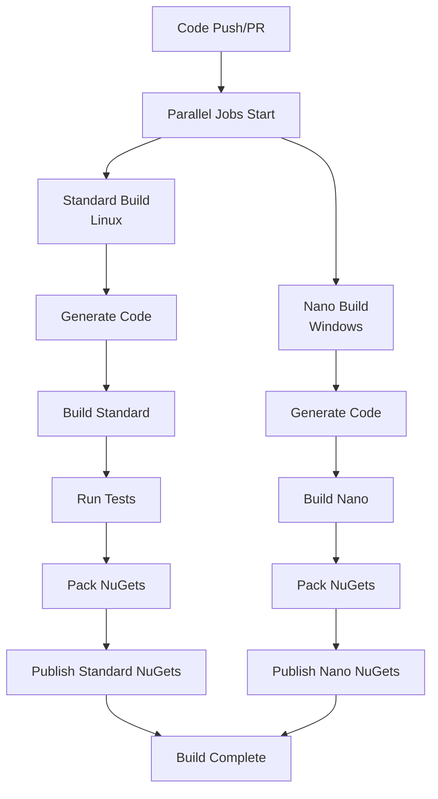

# CI/CD Optimization Guide for UnitsNet

## Overview

This guide describes the optimized CI/CD pipeline that separates **Standard** builds (all main projects) running on Linux from **Nano** builds (NanoFramework projects) running on Windows, providing significant performance improvements.

## Architecture

### Target Separation
- **Standard Target**: All main UnitsNet projects (Linux)
- **Nano Target**: NanoFramework projects only (Windows)

### Key Optimizations
1. **Parallel Execution**: Standard and Nano builds run concurrently
2. **Platform Optimization**: Linux for Standard (faster, cheaper), Windows for Nano (required)
3. **Separate Build/Test Steps**: Better time measurement and log visibility
4. **Immediate Publishing**: Each target publishes NuGets as soon as it's ready
5. **Shared Scripts**: Same build scripts work locally and in CI

## Performance Improvements

| Metric | Before | After | Improvement |
|--------|--------|-------|-------------|
| Total Build Time | ~15-20 min | ~8-12 min | **~40-50% faster** |
| GitHub Actions Cost | Standard | ~30% less | **Cost reduction** |
| Feedback Time (PRs) | 15+ min | 8-10 min | **Faster feedback** |

## Workflow Structure



## Implementation Files

### GitHub Workflows
- `.github/workflows/ci-optimized.yml` - Optimized CI for master/release branches
- `.github/workflows/pr-optimized.yml` - Optimized PR validation

### Build Scripts
- `build.sh` - Linux/macOS build script for Standard projects
- `Build/build.ps1` - Existing PowerShell script (still works, includes Nano option)

## Migration Plan

### Phase 1: Testing (Current)
1. New workflows created with `-optimized` suffix
2. Run alongside existing workflows for validation
3. Monitor for issues over several PRs

### Phase 2: Switchover
When confident (after 5-10 successful builds):
```bash
# Backup existing workflows
mv .github/workflows/ci.yml .github/workflows/ci-old.yml
mv .github/workflows/pr.yml .github/workflows/pr-old.yml

# Activate optimized workflows
mv .github/workflows/ci-optimized.yml .github/workflows/ci.yml
mv .github/workflows/pr-optimized.yml .github/workflows/pr.yml
```

### Phase 3: Cleanup
After 1-2 weeks of stable operation:
```bash
# Remove old workflows
rm .github/workflows/ci-old.yml
rm .github/workflows/pr-old.yml
```

## Rollback Plan

If issues arise:
```bash
# Immediate rollback
mv .github/workflows/ci.yml .github/workflows/ci-optimized.yml
mv .github/workflows/pr.yml .github/workflows/pr-optimized.yml
mv .github/workflows/ci-old.yml .github/workflows/ci.yml
mv .github/workflows/pr-old.yml .github/workflows/pr.yml
```

## Local Development

### Building Standard Projects (Linux/macOS)
```bash
./build.sh
```

### Building Standard Projects (Windows)
```powershell
./Build/build.ps1
```

### Building Everything Including Nano (Windows only)
```powershell
./Build/build.ps1 -IncludeNanoFramework
```

## Workflow Details

### Standard Build Job (Linux)
1. **Generate Code** - Run CodeGen to generate from JSON definitions
2. **Build** - Compile all projects in UnitsNet.slnx
3. **Test** - Run all tests with coverage collection
4. **Pack** - Create NuGet packages
5. **Publish** - Push to nuget.org (CI only, not PRs)

### Nano Build Job (Windows)
1. **Generate Code** - Run CodeGen to generate from JSON definitions
2. **Build** - Compile NanoFramework projects with MSBuild
3. **Pack** - Create NanoFramework NuGet packages
4. **Publish** - Push to nuget.org (CI only, not PRs)

## Benefits

### Performance
- **Faster builds** through parallel execution
- **Better resource usage** with platform-specific optimizations
- **Reduced queue time** with smaller, focused jobs

### Cost
- **~30% reduction** in GitHub Actions minutes
- Linux runners are cheaper than Windows
- More efficient resource utilization

### Developer Experience
- **Faster PR feedback** for quicker iteration
- **Clear build/test separation** for debugging
- **Same scripts locally and in CI** for consistency

### Maintainability
- **Simpler workflows** with clear separation of concerns
- **Easy to extend** with additional parallel jobs
- **Platform-appropriate tooling** for each target

## Monitoring

### Key Metrics to Track
- Build duration for each target
- Test pass rate
- NuGet publishing success rate
- GitHub Actions minute usage

### Success Criteria
- All builds complete in under 12 minutes
- 100% test pass rate maintained
- Successful NuGet publishing for all packages
- No increase in flaky test failures

## FAQ

**Q: Why separate Standard and Nano builds?**
A: NanoFramework requires Windows/MSBuild while other projects work better on Linux with dotnet CLI.

**Q: Can I still build everything locally?**
A: Yes, use the existing PowerShell scripts on Windows with `-IncludeNanoFramework` flag.

**Q: What if a build fails?**
A: Each target is independent. Fix the failing target without affecting the other.

**Q: How are NuGets published?**
A: Each target publishes its packages immediately upon successful build, no waiting for the other target.

## Support

For issues or questions about the optimized CI/CD pipeline:
1. Check workflow logs in GitHub Actions
2. Review this guide for troubleshooting
3. Open an issue if problems persist