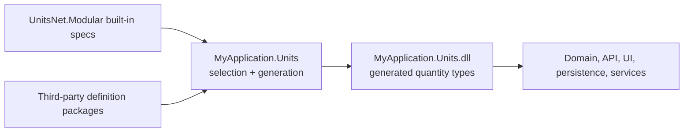

# Units.NET Modular

[](https://codespaces.new/angularsen/UnitsNet?devcontainer_path=.devcontainer%2Funitsnet-modular%2Fdevcontainer.json&quickstart=1)

[](https://github.com/angularsen/UnitsNet/actions/workflows/unitsnet-modular-ci.yml)

Generate only the strongly typed quantities and units your application needs.

You can select quantities and units from the UnitsNet catalog and add your own custom quantities and
units with JSON definitions. A source generator emits the types directly into your project.

The result keeps the familiar UnitsNet API without requiring the complete catalog:

- Generate only the quantities and units you use
- Combine built-in and custom definitions in one strongly typed model
- Get unit conversions, quantity relations, arithmetic, parsing, and formatting
- Catch definition and relationship errors at compile time
- Get trimming and Native AOT-friendly code

> **Experimental:** UnitsNet.Modular is a proof of concept and currently in pre-release. Its API,
> package structure, and compatibility guarantees may change as the architecture is evaluated.

Try the [UnitsNet.Modular samples in GitHub Codespaces](https://codespaces.new/angularsen/UnitsNet?devcontainer_path=.devcontainer%2Funitsnet-modular%2Fdevcontainer.json&quickstart=1)
without installing anything.

## Contents

- [Quick start](#quick-start)
- [How it differs from UnitsNet](#how-it-differs-from-unitsnet)
- [Choose a project structure](#choose-a-project-structure)
- [Use generated quantities](#use-generated-quantities)
- [Configure generation](#configure-generation)
- [Add custom quantities](#add-custom-quantities)
- [Add quantity relationships](#add-quantity-relationships)
- [Publish a definition package](#publish-a-definition-package)
- [Dynamic lookup and serialization](#dynamic-lookup-and-serialization)
- [Diagnostics](#diagnostics)
- [Troubleshooting](#troubleshooting)
- [Samples and design documents](#samples-and-design-documents)

## Quick start

UnitsNet.Modular supports .NET 8, .NET 9, and .NET 10. It replaces `UnitsNet` in a project; the two
packages cannot be referenced together. Remove `UnitsNet` if it is installed, then add the
prerelease package:

```shell
dotnet remove package UnitsNet
dotnet add package UnitsNet.Modular --prerelease
```

Generated built-in quantities use the `UnitsNet` namespace and unit enums use `UnitsNet.Units` by
default. Pass a namespace to `[UnitsNetModule("MyApplication.Units")]` to change it.

Add these two files to the project that references `UnitsNet.Modular`.

`ApplicationUnits.cs` declares the generation boundary and selects the built-in quantities:

```csharp
using UnitsNet.Modular;
using Catalog = UnitsNet.Modular.BuiltIns;

namespace MyApplication.Units;

[UnitsNetModule]
internal interface ApplicationUnits :
    IInclude<Catalog.LengthSpec>,
    IInclude<Catalog.DurationSpec>,
    IInclude<Catalog.SpeedSpec>;
```

`Program.cs` uses the generated API:

```csharp
using UnitsNet;
using UnitsNet.Units;

Length route = Length.FromKilometers(1.2);
Length remaining = Length.Parse("500 m");
Length total = route + remaining;
Speed pace = total / Duration.FromMinutes(2);

Console.WriteLine($"Total: {total.ToUnit(LengthUnit.Meter):F0}");
Console.WriteLine($"Pace: {pace:F1}");
```

Build the project. The source generator sees `ApplicationUnits`, then emits `Length`, `Duration`,
`Speed`, and their unit enums into your project. Because every participant is selected, it also
emits the `Length / Duration = Speed` relationship used above.

The `*Spec` interfaces are compile-time selections, not the generated quantities themselves. Each
selected quantity includes all its units unless a unit set filters them. The project containing the
module owns the generated CLR types, so other projects should reference that project rather than
declare another module.

## How it differs from UnitsNet

`UnitsNet` ships the complete catalog as precompiled types and supports runtime configuration.
UnitsNet.Modular source-generates your selected catalog at compile time and uses immutable generated
metadata instead of mutable global registrations.

### New in UnitsNet.Modular

- Select only the quantities and units your application needs
- Generate custom quantities and units from JSON alongside the built-in catalog
- Generate relationships and operators across built-in and custom quantities
- Put the generated types in a namespace and assembly you control
- Use generated discovery and serialization without runtime assembly scanning
- Produce trimming and Native AOT-friendly code

### Tradeoffs and missing features

- UnitsNet.Modular is a pre-release proof of concept, so its API and package structure may change
- It is not binary-compatible with `UnitsNet`; libraries compiled against `UnitsNet.dll` need a
  migration boundary
- Quantity selection and configuration happen at compile time; runtime mutation of conversions,
  abbreviations, and global defaults is not supported
- Each generated assembly owns distinct CLR types, so multi-project applications should share one
  generated units project
- Generated quantity values currently use `double`
- `Length.ParseFeetInches` and `Pressure` elevation modeling are not yet supported
- The System.Text.Json integration is still a proof of concept, and applications own serialized
  contract versioning

See the [migration guide](MIGRATION.md) for a detailed API comparison and migration options.

## Choose a project structure

### One application project

For a small application, place the module interface in the application project itself. The
generated types become part of that application's assembly.

```text
MyTool
├── MyTool.csproj       -> UnitsNet.Modular
├── ApplicationUnits.cs
└── Program.cs
```

### Shared units project

For a multi-project application, generate quantities once in a dedicated units project and
reference that project everywhere else:

```text
MyApplication.slnx
└── src
    ├── MyApplication.Units
    │   ├── MyApplication.Units.csproj -> UnitsNet.Modular + definition packages
    │   └── ApplicationUnits.cs
    ├── MyApplication.Domain           -> MyApplication.Units
    ├── MyApplication.Persistence      -> MyApplication.Units
    ├── MyApplication.Api              -> MyApplication.Units
    └── MyApplication.Cli              -> MyApplication.Units
```



This is the recommended setup. A generated public type belongs to the assembly into which it is
generated. Generating `Length` independently in two assemblies creates two different CLR types,
even when both came from the same spec. One application-owned generation boundary gives all
application projects the same type identity.

### Full catalog with UnitsNet-style namespaces

Generate the complete catalog into the established `UnitsNet` and `UnitsNet.Units` namespaces when
source compatibility is more important than assembly size:

```csharp
using UnitsNet.Modular;
using UnitsNet.Modular.Profiles;

[UnitsNetModule]
internal interface CompatibilityUnits : IIncludeProfile<AllQuantitiesProfile>;
```

This targets source compatibility for common construction, conversion, parsing, formatting,
arithmetic, and aggregation code. It does not make the generated structs binary-compatible with
types from `UnitsNet.dll`.

### Third-party quantities and units

A third-party definition package supplies specs rather than precompiled quantity structs. Reference
the package from your units project, select its public quantity specs, and generate the third-party
and built-in quantities together:

```csharp
using Acme.Measurements.Definitions;
using UnitsNet.Modular;
using Catalog = UnitsNet.Modular.BuiltIns;

[UnitsNetModule]
internal interface ApplicationUnits :
    IInclude<Catalog.LengthSpec>,
    IInclude<WidgetCountSpec>,
    IInclude<WidgetDistanceSpec>;
```

This lets the generator emit operators between custom and built-in quantities and avoids type
identity conflicts between independently compiled quantity packages.

## Use generated quantities

### Construct and convert

```csharp
Length a = Length.FromKilometers(1.5);
Length b = new(500, LengthUnit.Meter);
Length c = Length.From(2, LengthUnit.Mile);

double meters = a.As(LengthUnit.Meter);
Length inMeters = a.ToUnit(LengthUnit.Meter);
double converted = Length.Convert(1.5, LengthUnit.Kilometer, LengthUnit.Meter);
```

`As()` returns the numeric value in another unit. `ToUnit()` returns a quantity storing that unit.
The static `Convert()` method converts a raw numeric value without constructing a quantity.

### Arithmetic and relationships

Linear quantities support ordinary arithmetic:

```csharp
Length total = Length.FromMeters(2) + Length.FromCentimeters(50);
Length scaled = total * 3;
double ratio = total / Length.FromMeters(1);
```

Cross-quantity operators are emitted when all participating quantities are selected:

```csharp
Area area = Length.FromMeters(2) * Length.FromMeters(3);
Speed speed = Length.FromKilometers(10) / Duration.FromHours(1);
Force force = Mass.FromKilograms(5) * Acceleration.FromMetersPerSecondSquared(9.81);
Pressure pressure = force / Area.FromSquareMeters(2);
```

Multiplication relationships are generated in both operand orders when commutative. Division is
inferred unless the relation explicitly disables it.

Affine quantities use a selected linear offset quantity:

```csharp
Temperature freezing = Temperature.FromDegreesCelsius(0);
Temperature boiling = Temperature.FromDegreesCelsius(100);
TemperatureDelta range = boiling - freezing;
Temperature adjusted = freezing + TemperatureDelta.FromDegreesCelsius(2);
```

Selecting an affine quantity without its offset quantity produces diagnostic `UNM015`.
Logarithmic quantities retain logarithmic arithmetic instead of being treated as linear values.

### Parse, format, and localize

```csharp
using System.Globalization;

Length distance = Length.Parse("1.5 km", CultureInfo.InvariantCulture);
bool parsed = Length.TryParse("500 m", CultureInfo.InvariantCulture, out Length result);
LengthUnit unit = Length.ParseUnit("km", CultureInfo.InvariantCulture);
string abbreviation = Length.GetAbbreviation(LengthUnit.Kilometer, CultureInfo.InvariantCulture);

string text = distance.ToString("F2", CultureInfo.InvariantCulture); // 1.50 km
```

Unit singular names and plural names parse case-insensitively. Configured abbreviations are
case-sensitive. The requested culture is used first, with the definition's localization fallback
behavior supplying the default abbreviation.

### Aggregate

Generated extension methods delegate reusable algorithms to the `UnitsNet` runtime:

```csharp
Length sum = new[]
{
    Length.FromKilometers(1),
    Length.FromMeters(500),
}.Sum();

Length average = new[]
{
    Length.FromMeters(1),
    Length.FromCentimeters(300),
}.Average(LengthUnit.Meter);
```

Linear quantities provide `Sum()` and `Average()` overloads, including selector and target-unit
forms. Affine quantities provide meaningful averages. Logarithmic quantities provide `Sum()`,
`ArithmeticMean()`, and `GeometricMean()` with logarithmic semantics.

### Inspect immutable metadata

Each generated quantity exposes one strongly typed, immutable metadata object. Less-common
discovery data lives there instead of being duplicated across the quantity API, and the generated
registry stores that exact same instance:

```csharp
QuantityInfo<Length, LengthUnit> info = Length.Info;
UnitInfo<LengthUnit> kilometer = info[LengthUnit.Kilometer];

Length value = Length.From(1.5, kilometer.Value);
string abbreviation = kilometer.GetDefaultAbbreviation(CultureInfo.InvariantCulture);

Debug.Assert(info.BaseUnit.Value == LengthUnit.Meter);
Debug.Assert(info.Units.Contains(kilometer));
Debug.Assert(ReferenceEquals(info, Quantity.Registry.Get(typeof(Length))));
```

The quantity type owns common value behavior (`Value`, `Unit`, `Zero`, `From`, `Convert`, `As`,
`ToUnit`, parsing, and formatting). `Info` owns identity, base-unit metadata, the immutable `Units`
collection, and base dimensions. `UnitInfo<TUnit>.Value` is the represented enum value;
`SingularName` and `PluralName` describe it. `BaseUnitInfo`, `UnitInfos`, and `UnitInfo.Name` are
hidden source-compatibility aliases. Unlike the legacy mutable metadata model, generated metadata
does not expose configurable conversion expressions or global registration.

### Use an immutable unit system

`UnitSystem` and `BaseUnits` describe a preferred set of constituent units without changing global
state:

```csharp
using UnitsNet;

Length length = Length.From(1.5, UnitSystem.SI);
double meters = Length.FromKilometers(1.5).As(UnitSystem.SI);
Length normalized = length.ToUnit(UnitSystem.SI);
```

Resolution considers only units selected into the current module.

## Configure generation

### Authoring naming convention

Authoring types describe generation inputs, so their names distinguish them from the concrete types
they produce:

| Suffix | Purpose | Example |
|---|---|---|
| `Spec` | Identifies one built-in or custom quantity specification | `LengthSpec`, `HowMuchSpec` |
| `UnitSet` | Selects a reusable subset of a spec's units | `MetricLengthUnitSet` |
| `Profile` | Composes several specs and unit sets | `MechanicsProfile` |

The module interface names the generation boundary and can use an application-oriented name such as
`ApplicationUnits`. The `*Spec` suffix is the authoring convention for the corresponding generated
quantity and unit enum: `LengthSpec` specifies the `Length` quantity and its `LengthUnit` enum.

### Module declaration

`[UnitsNetModule]` marks the single generation boundary in a compilation:

```csharp
[UnitsNetModule]
internal interface ApplicationUnits :
    IInclude<UnitsNet.Modular.BuiltIns.LengthSpec>;
```

A compilation can contain one module marker. Compose a larger selection with profiles rather than
declaring multiple modules. `UNM014` reports multiple module markers before they emit colliding
types.

Without a target namespace, each definition keeps its declared namespace:

- built-in definitions generate quantities into `UnitsNet` and unit enums into `UnitsNet.Units`;
- custom definitions generate into their JSON `Namespace`;
- the generated `Quantity` facade is placed in `UnitsNet` when the module includes built-ins, or in
  the module interface's namespace for a custom-only module.

Pass a target namespace to override every selected definition and emit it into one namespace:

```csharp
[UnitsNetModule("Contoso.Measurements")]
internal interface ApplicationUnits :
    IInclude<UnitsNet.Modular.BuiltIns.LengthSpec>;
```

Targeting `UnitsNet` explicitly has the same compatibility behavior as the built-in default:
quantity types use `UnitsNet` and unit enums use `UnitsNet.Units`.

### Select quantities

Include every unit of a definition:

```csharp
IInclude<UnitsNet.Modular.BuiltIns.LengthSpec>
```

Include a filtered unit set:

```csharp
IInclude<UnitsNet.Modular.BuiltIns.LengthSpec, MetricLengthUnitSet>
```

Built-in spec names add the `Spec` suffix to quantity definition names in the UnitsNet catalog, so
the `Length` specification is selected with `UnitsNet.Modular.BuiltIns.LengthSpec`. The specs are generated
by the analyzer in `UnitsNet.Modular.BuiltIns`; generated quantities retain their familiar names,
such as `Length` and `LengthUnit`. Built-in and custom specs both declare their stable semantic ID
with `[QuantitySpec]`; the namespace and `Spec` suffix are naming conventions, not lookup
rules.

### Use profiles

UnitsNet.Modular currently supplies two profiles:

| Profile | Selection |
|---|---|
| `UnitsNet.Modular.Profiles.AllQuantitiesProfile` | Every built-in catalog quantity and unit |
| `UnitsNet.Modular.Profiles.AllSiProfile` | Focused SI mechanics chain used by the POC sample |

Include a profile and add individual definitions:

```csharp
[UnitsNetModule]
internal interface ApplicationUnits :
    IIncludeProfile<UnitsNet.Modular.Profiles.AllQuantitiesProfile>,
    IInclude<MyCustomSpec>;
```

Create reusable application profiles from the same authoring interfaces:

```csharp
internal interface MechanicsProfile :
    IInclude<UnitsNet.Modular.BuiltIns.LengthSpec>,
    IInclude<UnitsNet.Modular.BuiltIns.DurationSpec>,
    IInclude<UnitsNet.Modular.BuiltIns.SpeedSpec>;

internal interface ProductProfile :
    IIncludeProfile<MechanicsProfile>,
    IInclude<WidgetCountSpec>;

[UnitsNetModule]
internal interface ApplicationUnits :
    IIncludeProfile<ProductProfile>;
```

Profiles can be nested. A direct `IInclude<TQuantitySpec, TUnitSet>` on the module overrides profile
unit selections for that quantity. Direct `IInclude<TQuantitySpec>` selects every unit.

### Filter units

Declare a reusable unit set with `[UnitSet]`:

```csharp
[UnitSet("Meter", "Millimeter", "Kilometer")]
internal interface CommonLengthUnitSet;

[UnitSet("glob:*Meter")]
internal interface MeterUnitSet;

[UnitSet("regex:^(Meter|Centi.*|Kilo.*)$")]
internal interface MetricUnitSet;
```

Pattern behavior:

| Syntax | Behavior |
|---|---|
| `Meter` | Bare glob; exact name when it contains no `*` |
| `glob:*Meter` | Case-insensitive glob where `*` matches any characters |
| `regex:.*Meter$` | Case-insensitive, culture-invariant regular expression with a timeout |

Patterns match expanded singular unit names, not abbreviations. Prefix expansion happens before
filtering, so `.*Meter$` can match `Meter`, `Millimeter`, and `Kilometer`. The base unit is always
included to keep the quantity convertible. Invalid patterns and patterns matching no unit are
compile-time errors.

### Select files with MSBuild

Use Roslyn's native `AdditionalFiles` item for custom quantity and relation files:

```xml
<ItemGroup>
  <AdditionalFiles Include="Definitions/*.unitsnet.json"
                   UnitsNetDefinition="true" />
  <AdditionalFiles Include="Definitions/*.unitsnet.relations.json"
                   UnitsNetRelation="true" />
</ItemGroup>
```

The metadata is optional when the files use the conventional suffixes:

- `*.unitsnet.json`;
- `*.unitsnet.relations.json`.

Metadata is useful for ordinary names such as `Length.json`.

The package also supports the custom item aliases below:

```xml
<ItemGroup>
  <UnitsNetDefinition Include="Definitions/Length.json" />
  <UnitsNetRelation Include="Definitions/Relations.json" />
</ItemGroup>
```

The packaged MSBuild targets map these aliases to `AdditionalFiles`. Native `AdditionalFiles` is
recommended because some IDE project models, including current Rider versions, do not reliably pass
custom build actions to the design-time Roslyn host.

### Inspect generated source

Generated files normally stay in Roslyn's in-memory compilation. To write them beneath `obj` for
debugging or review, add:

```xml
<PropertyGroup>
  <EmitCompilerGeneratedFiles>true</EmitCompilerGeneratedFiles>
  <CompilerGeneratedFilesOutputPath>
    $(BaseIntermediateOutputPath)Generated
  </CompilerGeneratedFilesOutputPath>
</PropertyGroup>
```

Do not compile that output directory explicitly; the compiler already receives the generated
sources from Roslyn.

## Add custom quantities

### Register a definition

Add a JSON file to the units project:

```xml
<ItemGroup>
  <AdditionalFiles Include="HowMuch.unitsnet.json"
                   UnitsNetDefinition="true" />
</ItemGroup>
```

Bind a public or internal quantity spec interface to the definition's stable semantic ID:

```csharp
using UnitsNet.Modular;

namespace Fictional.Measurements.Definitions;

[QuantitySpec("Fictional.Measurements.HowMuch")]
public interface HowMuchSpec;
```

Select the spec in the module:

```csharp
[UnitsNetModule]
internal interface ApplicationUnits : IInclude<HowMuchSpec>;
```

The spec ID must match `Namespace.Name` in the JSON definition. If `Namespace` is omitted, it
defaults to `UnitsNet`. Treat this semantic ID as a package-boundary identifier: use a namespace
you own so independently authored definition packages cannot describe unrelated quantities with
the same identity.

### Define the quantity in JSON

Define the quantity, its units, abbreviations, and conversions in the `MyQuantity.unitsnet.json`
file. Each unit provides one expression for converting to the quantity's base unit and another for
converting back. The two expressions should round-trip every supported value.

See [HowMuch.unitsnet.json](Samples/CustomQuantitySample/HowMuch.unitsnet.json) for a complete example and the
[Quantity and Unit Definition Schema](../Docs/quantity-and-unit-definition-schema.md#unitsnetmodular-compatibility)
for the full field reference.

## Add quantity relationships

Add a relation file as an `AdditionalFiles` item:

```xml
<AdditionalFiles Include="Fictional.unitsnet.relations.json"
                 UnitsNetRelation="true" />
```

Structured relations use stable semantic quantity IDs and invariant unit names:

```json
[
  {
    "result": {
      "quantity": "Fictional.Measurements.HowMuchDistance",
      "unit": "SomeMeter"
    },
    "left": {
      "quantity": "Fictional.Measurements.HowMuch",
      "unit": "Some"
    },
    "operator": "*",
    "right": {
      "quantity": "UnitsNet.Length",
      "unit": "Meter"
    },
    "noInferredDivision": false
  }
]
```

Only multiplication relations are declared. The generator:

- emits both operand orders when the operands are different;
- infers the corresponding division operator;
- skips inferred division when `noInferredDivision` is true;
- emits operators only when every participating quantity is selected;
- uses the relation's anchor units internally even when a unit filter omits those units publicly.

The special endpoint quantities `"double"` and `"1"` describe scalar and reciprocal relationships.
The older UnitsNet string form is also accepted:

```json
[
  "Area.SquareMeter = Length.Meter * Length.Meter",
  "Speed.MeterPerSecond = Length.Meter * Frequency.Hertz -- NoInferredDivision"
]
```

Structured relations are recommended for third-party definitions because fully qualified semantic
IDs remain unambiguous across namespaces.

## Publish a definition package

A definition package distributes public quantity specs, JSON definitions, relationships, and an
MSBuild props file, but does not generate or ship the resulting quantity structs.

```text
Acme.Measurements.Definitions
├── DefinitionMarkers.cs
├── Definitions
│   ├── WidgetCount.unitsnet.json
│   └── Acme.unitsnet.relations.json
├── build
│   └── Acme.Measurements.Definitions.props
└── Acme.Measurements.Definitions.csproj
```

Pack the definition files and props:

```xml
<ItemGroup>
  <None Include="Definitions/*.unitsnet.json"
        Pack="true"
        PackagePath="build/definitions" />
  <None Include="Definitions/*.unitsnet.relations.json"
        Pack="true"
        PackagePath="build/definitions" />
  <None Include="build/Acme.Measurements.Definitions.props"
        Pack="true"
        PackagePath="build/Acme.Measurements.Definitions.props" />
</ItemGroup>
```

The props file contributes those files directly to the referencing project's compilation:

```xml
<Project>
  <ItemGroup>
    <AdditionalFiles Include="$(MSBuildThisFileDirectory)definitions/*.unitsnet.json"
                     UnitsNetDefinition="true" />
    <AdditionalFiles Include="$(MSBuildThisFileDirectory)definitions/*.unitsnet.relations.json"
                     UnitsNetRelation="true" />
  </ItemGroup>
</Project>
```

Quantity specs should be public so projects can select them. Keep their `[QuantitySpec]` semantic
IDs stable once published.

An organization can instead publish one canonical compiled units assembly for several controlled
applications. That is a deployment choice, not the primary composition model. Independently
compiled modules do not share type identity or automatically gain cross-module operators.

## Dynamic lookup and serialization

Every module receives one immutable registry containing only its selected quantities:

```csharp
using UnitsNet;

var registry = GeneratedQuantityRegistry.Instance;

IQuantityDescriptor length = registry.Get("Length");
IQuantity<double> parsed = length.Parse("1.5 km");
double meters = length.Convert(1.5, "Kilometer", "Meter");

IQuantity<double> created = registry.Create(
    500,
    "Length",
    "Meter");
```

The registry supports lookup by semantic `QuantityId`, definition name, quantity CLR type, and unit
enum CLR type. Descriptors expose selected units, abbreviations, base dimensions, creation,
conversion, parsing, formatting, and stored value/unit access. `TryGet`, `TryCreate`, `TryConvert`,
and `TryParse` variants are available for non-throwing workflows.

When a module includes built-ins, the generator emits the source-compatible `Quantity` facade into
`UnitsNet`:

```csharp
using UnitsNet;

IQuantity<double> value =
    UnitsNet.Quantity.From(1.5, "Length", "Kilometer");

IQuantity<double> parsed =
    UnitsNet.Quantity.Parse(typeof(Length), "1.5 km");
```

A custom-only module places its facade in the module interface's namespace unless the
`UnitsNetModule` attribute specifies an explicit target namespace.

### System.Text.Json

Register the generated, AOT-safe converter factory:

```csharp
using System.Text.Json;
using UnitsNet;

var options = new JsonSerializerOptions();
options.Converters.Add(GeneratedQuantityRegistry.JsonConverter);

string json = JsonSerializer.Serialize(Length.FromKilometers(1.5), options);
Length restored = JsonSerializer.Deserialize<Length>(json, options);
```

The shape is:

```json
{
  "Value": 1.5,
  "Unit": "Kilometer"
}
```

Applications own the compatibility and versioning of serialized contracts. Semantic quantity IDs
and invariant unit names are the recommended boundary between independently compiled modules. The
generated converter handles selected concrete quantity types. Deserializing a polymorphic
`IQuantity<double>` directly is deliberately unsupported because the serialized shape does not
carry a CLR type or semantic quantity ID; resolve a descriptor by semantic ID at that boundary
instead.

## Diagnostics

UnitsNet.Modular reports authoring problems at compile time:

| ID | Meaning |
|---|---|
| `UNM001` | A selected quantity spec has no built-in or JSON definition |
| `UNM002` | A unit pattern matched no unit |
| `UNM003` | A definition does not contain its declared base unit |
| `UNM004` | A JSON quantity definition is invalid |
| `UNM005` | Multiple JSON files provide the same semantic quantity ID |
| `UNM006` | A glob or regular expression is invalid |
| `UNM010` | A relation file is invalid |
| `UNM011` | Selected relations are ambiguous or cannot be resolved |
| `UNM012` | A selected unit set has no patterns |
| `UNM013` | Definitions collide after applying the target namespace |
| `UNM014` | A compilation declares more than one module |
| `UNM015` | An affine quantity's offset quantity is not selected |
| `UNM016` | The module project also references the incompatible legacy `UnitsNet` assembly |

Each diagnostic links to the relevant configuration documentation from IDEs that display analyzer
help links.

## Troubleshooting

### A generated quantity type is not found

Confirm that the project either declares a single `[UnitsNetModule]` or references the shared units
project that does. Select the quantity with `IInclude<TSpec>` or a profile, then build the module
project. Check the build output for `UNM` diagnostics; the generator does not emit a quantity that
was not selected.

If the build succeeds but editor completion remains stale, inspect the IDE's source-generator node
to confirm that quantity sources were emitted. Rebuild and reload the project or solution to refresh
the design-time Roslyn host. This can be necessary after changing analyzer packages or
`AdditionalFiles` inputs even though command-line builds already see the generated code.

### A custom JSON definition is ignored

Use Roslyn's native `AdditionalFiles` item so command-line and design-time builds receive the same
input:

```xml
<ItemGroup>
  <AdditionalFiles Include="Definitions/*.unitsnet.json" />
</ItemGroup>
```

The definition's `Namespace.Name` must match the semantic ID on `[QuantitySpec]`, and the spec must
also be selected by the module. See [Add custom quantities](#add-custom-quantities).

### A relationship operator is missing

Relationships are emitted only when every participating quantity is selected. For example,
`Length / Duration` requires `LengthSpec`, `DurationSpec`, and `SpeedSpec`. Add the missing result or
operand quantity and rebuild.

### A filtered base unit is still generated

This is intentional. Every selected quantity keeps its base unit as a conversion anchor even when a
unit-set pattern does not match it.

### The project reports `UNM016`

`UnitsNet` and `UnitsNet.Modular` are alternative implementations and cannot be referenced together
in the module project. Remove the legacy package reference or move the generated quantities behind a
separate assembly boundary. See the [migration guide](MIGRATION.md) for compatibility options.

## Samples and design documents

| Start here | Scenario |
|---|---|
| [Samples overview](Samples) | Choose a focused scenario and switch between project references, local packages, and published packages |
| [Getting started](Samples/GettingStartedSample) | Minimal `Length`, `Duration`, and `Speed` application matching the quick start |
| [Quantity selection](Samples/QuantitySelectionSample) | Select individual quantities and filter their units |
| [Custom quantity](Samples/CustomQuantitySample) | Generate an application-owned quantity from JSON |
| [All SI profile](Samples/Profiles/AllSiProfileSample) | Exercise the quantities and relationships selected by `AllSiProfile` |
| [Playground](Samples/ModularPlayground) | Explore relationships, aggregation, metadata, serialization, and custom definitions |
| [Shared units library](Samples/SharedUnitsLibrarySample) | Share one generated quantity assembly across several projects |

For design rationale and compatibility details, continue with
[Architecture](ARCHITECTURE.md) and [Migration notes](MIGRATION.md).
