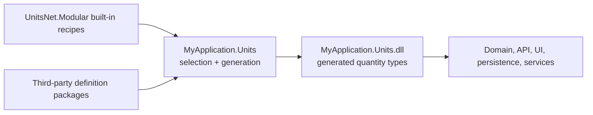

# UnitsNet Modular

[](https://github.com/angularsen/UnitsNet/actions/workflows/unitsnet-modular-ci.yml)

Generate only the strongly typed quantities and units your application needs.

UnitsNet.Modular combines a small runtime with a Roslyn source generator. A consumer selects quantities
from the UnitsNet catalog, optionally filters their units, and can add application-specific or
third-party JSON definitions. The generator emits quantity structs, unit enums, conversions,
parsing, formatting, localization, arithmetic, and relationships directly into a consumer-owned
assembly.

The result keeps the familiar strengths of UnitsNet without requiring every application to carry
the complete catalog:

- strongly typed quantities and unit enums;
- compile-time selection of quantities and units;
- built-in, custom, and third-party definitions in one generated model;
- affine, logarithmic, and nonlinear conversions;
- localized parsing and formatting;
- cross-quantity operators and aggregation;
- immutable runtime discovery and System.Text.Json support;
- trimming and Native AOT-friendly generated code.

> **Experimental:** UnitsNet.Modular is an alpha proof of concept. Its API, package structure, and
> compatibility guarantees may change as the architecture is evaluated.

## Contents

- [Install](#install)
- [Quick start](#quick-start)
- [Choose a project structure](#choose-a-project-structure)
- [Use generated quantities](#use-generated-quantities)
- [Configure generation](#configure-generation)
- [Add custom quantities](#add-custom-quantities)
- [Add quantity relationships](#add-quantity-relationships)
- [Publish a definition package](#publish-a-definition-package)
- [Dynamic lookup and serialization](#dynamic-lookup-and-serialization)
- [Diagnostics](#diagnostics)
- [Current scope and limitations](#current-scope-and-limitations)

## Install

UnitsNet.Modular supports .NET 8, .NET 9, and .NET 10. Install the prerelease package in the project that
will own the generated quantities:

```shell
dotnet add package UnitsNet.Modular --prerelease
```

The package includes the runtime and source generator and brings in `UnitsNet.Core`, which contains
the shared quantity contracts. No separate analyzer package is required.

## Quick start

Declare one module interface and select the built-in quantities to generate:

```csharp
using UnitsNet;
using UnitsNet.Modular;
using UnitsNet.Units;
using Catalog = UnitsNet.Modular.BuiltIns;

namespace MyApplication.Units;

[UnitsNetModule]
internal interface ApplicationUnits :
    IInclude<Catalog.Length>,
    IInclude<Catalog.Duration>,
    IInclude<Catalog.Speed>;
```

Build the project. UnitsNet.Modular generates `Length`, `Duration`, `Speed`, their unit enums, and the
relationships between them into the familiar `UnitsNet` and `UnitsNet.Units` namespaces.

```csharp
Length route = Length.FromKilometers(1.2);
Length remaining = Length.Parse("500 m");
Length total = route + remaining;
Speed pace = total / Duration.FromMinutes(2);

Console.WriteLine(total.ToUnit(LengthUnit.Meter)); // 1700 m
Console.WriteLine(pace);
```

Only selected quantities are generated. Each selected quantity includes all its units unless a
unit set filters them.

## Choose a project structure

### One application project

For a small application, place the module interface in the application project itself. The
generated types become part of that application's assembly.

```text
MyTool
├── MyTool.csproj       -> UnitsNet.Modular
├── ApplicationUnits.cs
└── Program.cs
```

### Shared consumer-owned units project

For a multi-project application, generate quantities once in a dedicated units project and
reference that project everywhere else:

```text
MyApplication.slnx
└── src
    ├── MyApplication.Units
    │   ├── MyApplication.Units.csproj -> UnitsNet.Modular + definition packages
    │   └── ApplicationUnits.cs
    ├── MyApplication.Domain           -> MyApplication.Units
    ├── MyApplication.Persistence      -> MyApplication.Units
    ├── MyApplication.Api              -> MyApplication.Units
    └── MyApplication.Cli              -> MyApplication.Units
```



This is the recommended setup. A generated public type belongs to the assembly into which it is
generated. Generating `Length` independently in two assemblies creates two different CLR types,
even when both came from the same recipe. One application-owned generation boundary gives all
application projects the same type identity.

### Full catalog with UnitsNet-style namespaces

Generate the complete catalog into the established `UnitsNet` and `UnitsNet.Units` namespaces when
source compatibility is more important than assembly size:

```csharp
using UnitsNet.Modular;
using UnitsNet.Modular.Profiles;

[UnitsNetModule]
internal interface CompatibilityUnits : IIncludeProfile<AllQuantities>;
```

This targets source compatibility for common construction, conversion, parsing, formatting,
arithmetic, and aggregation code. It does not make the generated structs binary-compatible with
types from `UnitsNet.dll`.

### Third-party quantities

A third-party definition package supplies recipes rather than precompiled quantity structs. The
consumer references the package, selects its public definition markers in the application units
project, and generates the third-party and built-in quantities together:

```csharp
using Acme.Measurements.Definitions;
using UnitsNet.Modular;
using Catalog = UnitsNet.Modular.BuiltIns;

[UnitsNetModule]
internal interface ApplicationUnits :
    IInclude<Catalog.Length>,
    IInclude<WidgetCountDefinition>,
    IInclude<WidgetDistanceDefinition>;
```

This lets the generator emit operators between custom and built-in quantities and avoids type
identity conflicts between independently compiled quantity packages.

## Use generated quantities

### Construct and convert

```csharp
Length a = Length.FromKilometers(1.5);
Length b = new(500, LengthUnit.Meter);
Length c = Length.From(2, LengthUnit.Mile);

double meters = a.As(LengthUnit.Meter);
Length inMeters = a.ToUnit(LengthUnit.Meter);
double converted = Length.Convert(1.5, LengthUnit.Kilometer, LengthUnit.Meter);
```

`As()` returns the numeric value in another unit. `ToUnit()` returns a quantity storing that unit.
The static `Convert()` method converts a raw numeric value without constructing a quantity.

### Arithmetic and relationships

Linear quantities support ordinary arithmetic:

```csharp
Length total = Length.FromMeters(2) + Length.FromCentimeters(50);
Length scaled = total * 3;
double ratio = total / Length.FromMeters(1);
```

Cross-quantity operators are emitted when all participating quantities are selected:

```csharp
Area area = Length.FromMeters(2) * Length.FromMeters(3);
Speed speed = Length.FromKilometers(10) / Duration.FromHours(1);
Force force = Mass.FromKilograms(5) * Acceleration.FromMetersPerSecondSquared(9.81);
Pressure pressure = force / Area.FromSquareMeters(2);
```

Multiplication relationships are generated in both operand orders when commutative. Division is
inferred unless the relation explicitly disables it.

Affine quantities use a selected linear offset quantity:

```csharp
Temperature freezing = Temperature.FromDegreesCelsius(0);
Temperature boiling = Temperature.FromDegreesCelsius(100);
TemperatureDelta range = boiling - freezing;
Temperature adjusted = freezing + TemperatureDelta.FromDegreesCelsius(2);
```

Selecting an affine quantity without its offset quantity produces diagnostic `UNM015`.
Logarithmic quantities retain logarithmic arithmetic instead of being treated as linear values.

### Parse, format, and localize

```csharp
using System.Globalization;

Length distance = Length.Parse("1.5 km", CultureInfo.InvariantCulture);
bool parsed = Length.TryParse("500 m", CultureInfo.InvariantCulture, out Length result);
LengthUnit unit = Length.ParseUnit("km", CultureInfo.InvariantCulture);
string abbreviation = Length.GetAbbreviation(LengthUnit.Kilometer, CultureInfo.InvariantCulture);

string text = distance.ToString("F2", CultureInfo.InvariantCulture); // 1.50 km
```

Unit singular names and plural names parse case-insensitively. Configured abbreviations are
case-sensitive. The requested culture is used first, with the definition's localization fallback
behavior supplying the default abbreviation.

### Aggregate

Generated extension methods delegate reusable algorithms to `UnitsNet.Core`:

```csharp
Length sum = new[]
{
    Length.FromKilometers(1),
    Length.FromMeters(500),
}.Sum();

Length average = new[]
{
    Length.FromMeters(1),
    Length.FromCentimeters(300),
}.Average(LengthUnit.Meter);
```

Linear quantities provide `Sum()` and `Average()` overloads, including selector and target-unit
forms. Affine quantities provide meaningful averages. Logarithmic quantities provide `Sum()`,
`ArithmeticMean()`, and `GeometricMean()` with logarithmic semantics.

### Use an immutable unit system

`UnitSystem` and `BaseUnits` describe a preferred set of constituent units without changing global
state:

```csharp
Length length = Length.From(1.5, UnitsNet.Modular.UnitSystem.SI);
double meters = Length.FromKilometers(1.5).As(UnitsNet.Modular.UnitSystem.SI);
Length normalized = length.ToUnit(UnitsNet.Modular.UnitSystem.SI);
```

Resolution considers only units selected into the current module.

## Configure generation

### Module declaration

`[UnitsNetModule]` marks the single generation boundary in a compilation:

```csharp
[UnitsNetModule]
internal interface ApplicationUnits :
    IInclude<UnitsNet.Modular.BuiltIns.Length>;
```

A compilation can contain one module marker. Compose a larger selection with profiles rather than
declaring multiple modules. `UNM014` reports multiple module markers before they emit colliding
types.

Without a target namespace, each definition keeps its declared namespace:

- built-in definitions generate quantities into `UnitsNet` and unit enums into `UnitsNet.Units`;
- custom definitions generate into their JSON `Namespace`;
- the generated `Quantity` facade is placed in `UnitsNet` when the module includes built-ins, or in
  the module interface's namespace for a custom-only module.

Pass a target namespace to override every selected definition and emit it into one namespace:

```csharp
[UnitsNetModule("Contoso.Measurements")]
internal interface ApplicationUnits :
    IInclude<UnitsNet.Modular.BuiltIns.Length>;
```

Targeting `UnitsNet` explicitly has the same compatibility behavior as the built-in default:
quantity types use `UnitsNet` and unit enums use `UnitsNet.Units`.

### Select quantities

Include every unit of a definition:

```csharp
IInclude<UnitsNet.Modular.BuiltIns.Length>
```

Include a filtered unit set:

```csharp
IInclude<UnitsNet.Modular.BuiltIns.Length, MetricLengthUnits>
```

Built-in marker names match the quantity definition names in the UnitsNet catalog. The markers are
generated by the analyzer in `UnitsNet.Modular.BuiltIns`.

### Use profiles

UnitsNet.Modular currently supplies two profiles:

| Profile | Selection |
|---|---|
| `UnitsNet.Modular.Profiles.AllQuantities` | Every built-in catalog quantity and unit |
| `UnitsNet.Modular.Profiles.AllSi` | Focused SI mechanics chain used by the POC sample |

Include a profile and add individual definitions:

```csharp
[UnitsNetModule]
internal interface ApplicationUnits :
    IIncludeProfile<UnitsNet.Modular.Profiles.AllQuantities>,
    IInclude<MyCustomDefinition>;
```

Create reusable application profiles from the same authoring interfaces:

```csharp
internal interface MechanicsProfile :
    IInclude<UnitsNet.Modular.BuiltIns.Length>,
    IInclude<UnitsNet.Modular.BuiltIns.Duration>,
    IInclude<UnitsNet.Modular.BuiltIns.Speed>;

internal interface ProductProfile :
    IIncludeProfile<MechanicsProfile>,
    IInclude<WidgetCountDefinition>;

[UnitsNetModule]
internal interface ApplicationUnits :
    IIncludeProfile<ProductProfile>;
```

Profiles can be nested. A direct `IInclude<TDefinition, TUnitSet>` on the module overrides profile
unit selections for that quantity. Direct `IInclude<TDefinition>` selects every unit.

### Filter units

Declare a reusable marker with `[UnitSet]`:

```csharp
[UnitSet("Meter", "Millimeter", "Kilometer")]
internal interface CommonLengthUnits;

[UnitSet("glob:*Meter")]
internal interface MeterUnits;

[UnitSet("regex:^(Meter|Centi.*|Kilo.*)$")]
internal interface MetricUnits;
```

Pattern behavior:

| Syntax | Behavior |
|---|---|
| `Meter` | Bare glob; exact name when it contains no `*` |
| `glob:*Meter` | Case-insensitive glob where `*` matches any characters |
| `regex:.*Meter$` | Case-insensitive, culture-invariant regular expression with a timeout |

Patterns match expanded singular unit names, not abbreviations. Prefix expansion happens before
filtering, so `.*Meter$` can match `Meter`, `Millimeter`, and `Kilometer`. The base unit is always
included to keep the quantity convertible. Invalid patterns and patterns matching no unit are
compile-time errors.

### Select files with MSBuild

Use Roslyn's native `AdditionalFiles` item for custom quantity and relation files:

```xml
<ItemGroup>
  <AdditionalFiles Include="Definitions/*.unitsnet.json"
                   UnitsNetDefinition="true" />
  <AdditionalFiles Include="Definitions/*.unitsnet.relations.json"
                   UnitsNetRelation="true" />
</ItemGroup>
```

The metadata is optional when the files use the conventional suffixes:

- `*.unitsnet.json`;
- `*.unitsnet.relations.json`.

Metadata is useful for ordinary names such as `Length.json`.

The package also supports the custom item aliases below:

```xml
<ItemGroup>
  <UnitsNetDefinition Include="Definitions/Length.json" />
  <UnitsNetRelation Include="Definitions/Relations.json" />
</ItemGroup>
```

The packaged MSBuild targets map these aliases to `AdditionalFiles`. Native `AdditionalFiles` is
recommended because some IDE project models, including current Rider versions, do not reliably pass
custom build actions to the design-time Roslyn host.

### Inspect generated source

Generated files normally stay in Roslyn's in-memory compilation. To write them beneath `obj` for
debugging or review, add:

```xml
<PropertyGroup>
  <EmitCompilerGeneratedFiles>true</EmitCompilerGeneratedFiles>
  <CompilerGeneratedFilesOutputPath>
    $(BaseIntermediateOutputPath)Generated
  </CompilerGeneratedFilesOutputPath>
</PropertyGroup>
```

Do not compile that output directory explicitly; the compiler already receives the generated
sources from Roslyn.

## Add custom quantities

### Register a definition

Add a JSON file to the units project:

```xml
<ItemGroup>
  <AdditionalFiles Include="HowMuch.unitsnet.json"
                   UnitsNetDefinition="true" />
</ItemGroup>
```

Bind a public or internal marker interface to the definition's stable semantic ID:

```csharp
using UnitsNet.Modular;

namespace Fictional.Measurements.Definitions;

[QuantityDefinition("Fictional.Measurements.HowMuch")]
public interface HowMuchDefinition;
```

Select the marker in the module:

```csharp
[UnitsNetModule]
internal interface ApplicationUnits : IInclude<HowMuchDefinition>;
```

The marker ID must match `Namespace.Name` in the JSON definition. If `Namespace` is omitted, it
defaults to `UnitsNet`.

### Quantity definition JSON

A compact nonlinear definition with prefixes and localization looks like this:

```json
{
  "Name": "HowMuch",
  "Namespace": "Fictional.Measurements",
  "BaseUnit": "Some",
  "BaseDimensions": {},
  "Units": [
    {
      "SingularName": "Some",
      "PluralName": "Some",
      "FromUnitToBaseFunc": "{x}",
      "FromBaseToUnitFunc": "{x}",
      "Prefixes": [ "Kilo" ],
      "Localization": [
        {
          "Culture": "en-US",
          "Abbreviations": [ "sm" ]
        },
        {
          "Culture": "nb-NO",
          "Abbreviations": [ "noe" ],
          "AbbreviationsForPrefixes": {
            "Kilo": "knoe"
          }
        }
      ]
    },
    {
      "SingularName": "Magnitude",
      "PluralName": "Magnitudes",
      "FromUnitToBaseFunc": "Math.Pow({x}, 2)",
      "FromBaseToUnitFunc": "Math.Sqrt({x})",
      "Localization": [
        {
          "Culture": "en-US",
          "Abbreviations": [ "mag" ]
        }
      ]
    }
  ]
}
```

Supported quantity fields:

| Field | Required | Meaning |
|---|---:|---|
| `Name` | Yes | Generated quantity type name |
| `Namespace` | No | Definition namespace and part of its semantic ID; defaults to `UnitsNet` |
| `BaseUnit` | Yes | `SingularName` of the unit used as the conversion base |
| `Units` | Yes | Unit definitions; one must match `BaseUnit` |
| `BaseDimensions` | No | SI dimension exponents keyed by `L`, `M`, `T`, `I`, `Θ`, `N`, and `J` |
| `AffineOffsetType` | No | Linear offset quantity name or semantic ID required by an affine quantity |
| `Logarithmic` | No | String boolean such as `"True"`; defaults to false |
| `LogarithmicScalingFactor` | No | Invariant numeric string used by logarithmic aggregation; defaults to `1` |

The base-dimension symbols are `L` (length), `M` (mass), `T` (time), `I` (electric current),
`Θ` (temperature), `N` (amount of substance), and `J` (luminous intensity). Omitted exponents
default to zero. An unqualified `AffineOffsetType` resolves in the quantity's semantic namespace.

Supported unit fields:

| Field | Required | Meaning |
|---|---:|---|
| `SingularName` | Yes | Unit enum member and singular parse name |
| `PluralName` | Yes | Plural parse name |
| `FromUnitToBaseFunc` | Yes | Converts `{x}` from this unit to the quantity base unit |
| `FromBaseToUnitFunc` | Yes | Converts `{x}` from the base unit to this unit |
| `BaseUnits` | No | Constituent base-unit names keyed by the seven SI symbols |
| `Prefixes` | No | Prefix names expanded into additional units |
| `Localization` | No | Culture-specific abbreviations |

Each localization contains:

| Field | Required | Meaning |
|---|---:|---|
| `Culture` | Recommended | Culture name such as `en-US` or `nb-NO` |
| `Abbreviations` | No | Ordered abbreviations; the first is used for formatting |
| `AbbreviationsForPrefixes` | No | Prefix-specific string or string-array overrides |

Property names are case-insensitive. Comments and trailing commas are accepted so existing UnitsNet
catalog files can be consumed without rewriting them.

Supported decimal prefixes are `Femto`, `Pico`, `Nano`, `Micro`, `Milli`, `Centi`, `Deci`, `Deca`,
`Hecto`, `Kilo`, `Mega`, `Giga`, `Tera`, `Peta`, and `Exa`. Supported binary prefixes are `Kibi`,
`Mebi`, `Gibi`, `Tebi`, `Pebi`, and `Exbi`.

### Conversion expressions

Both conversion functions are required and must be inverses over the useful domain of the unit.
UnitsNet.Modular validates and emits the expressions at compile time; it does not compile strings or use
reflection at runtime.

The expression language supports:

- numeric literals and `{x}`;
- unary `+` and `-`;
- `+`, `-`, `*`, `/`, and `%`;
- parentheses;
- `Math.PI` and `Math.E`;
- `Math.Abs`, `Math.Exp`, `Math.Log`, `Math.Log10`, `Math.Pow`, and `Math.Sqrt`.

Examples:

```json
{
  "FromUnitToBaseFunc": "({x} * 9 / 5) + 32",
  "FromBaseToUnitFunc": "({x} - 32) * 5 / 9"
}
```

```json
{
  "FromUnitToBaseFunc": "Math.Pow({x}, 2)",
  "FromBaseToUnitFunc": "Math.Sqrt({x})"
}
```

## Add quantity relationships

Add a relation file as an `AdditionalFiles` item:

```xml
<AdditionalFiles Include="Fictional.unitsnet.relations.json"
                 UnitsNetRelation="true" />
```

Structured relations use stable semantic quantity IDs and invariant unit names:

```json
[
  {
    "result": {
      "quantity": "Fictional.Measurements.HowMuchDistance",
      "unit": "SomeMeter"
    },
    "left": {
      "quantity": "Fictional.Measurements.HowMuch",
      "unit": "Some"
    },
    "operator": "*",
    "right": {
      "quantity": "UnitsNet.Length",
      "unit": "Meter"
    },
    "noInferredDivision": false
  }
]
```

Only multiplication recipes are declared. The generator:

- emits both operand orders when the operands are different;
- infers the corresponding division operator;
- skips inferred division when `noInferredDivision` is true;
- emits operators only when every participating quantity is selected;
- uses the relation's anchor units internally even when a unit filter omits those units publicly.

The special endpoint quantities `"double"` and `"1"` describe scalar and reciprocal relationships.
The older UnitsNet string form is also accepted:

```json
[
  "Area.SquareMeter = Length.Meter * Length.Meter",
  "Speed.MeterPerSecond = Length.Meter * Frequency.Hertz -- NoInferredDivision"
]
```

Structured relations are recommended for third-party definitions because fully qualified semantic
IDs remain unambiguous across namespaces.

## Publish a definition package

A definition package is a recipe package. It contains marker interfaces, JSON definitions,
relationships, and an MSBuild props file, but does not generate or ship the resulting quantity
structs.

```text
Acme.Measurements.Definitions
├── DefinitionMarkers.cs
├── Definitions
│   ├── WidgetCount.unitsnet.json
│   └── Acme.unitsnet.relations.json
├── build
│   └── Acme.Measurements.Definitions.props
└── Acme.Measurements.Definitions.csproj
```

Pack the definition files and props:

```xml
<ItemGroup>
  <None Include="Definitions/*.unitsnet.json"
        Pack="true"
        PackagePath="build/definitions" />
  <None Include="Definitions/*.unitsnet.relations.json"
        Pack="true"
        PackagePath="build/definitions" />
  <None Include="build/Acme.Measurements.Definitions.props"
        Pack="true"
        PackagePath="build/Acme.Measurements.Definitions.props" />
</ItemGroup>
```

The props file contributes those files directly to the referencing consumer's compilation:

```xml
<Project>
  <ItemGroup>
    <AdditionalFiles Include="$(MSBuildThisFileDirectory)definitions/*.unitsnet.json"
                     UnitsNetDefinition="true" />
    <AdditionalFiles Include="$(MSBuildThisFileDirectory)definitions/*.unitsnet.relations.json"
                     UnitsNetRelation="true" />
  </ItemGroup>
</Project>
```

Definition markers should be public so the consumer can select them. Keep their
`[QuantityDefinition]` IDs stable once published.

An organization can instead publish one canonical compiled units assembly for several controlled
applications. That is a deployment choice, not the primary composition model. Independently
compiled modules do not share type identity or automatically gain cross-module operators.

## Dynamic lookup and serialization

Every module receives one immutable registry containing only its selected quantities:

```csharp
using UnitsNet.Core;
using UnitsNet.Modular.Generated;

UnitsNet.Modular.QuantityRegistry registry = GeneratedQuantityRegistry.Instance;

UnitsNet.Modular.IQuantityDescriptor length = registry.Get("Length");
IQuantity<double> parsed = length.Parse("1.5 km");
double meters = length.Convert(1.5, "Kilometer", "Meter");

IQuantity<double> created = registry.Create(
    500,
    "Length",
    "Meter");
```

The registry supports lookup by semantic `QuantityId`, definition name, quantity CLR type, and unit
enum CLR type. Descriptors expose selected units, abbreviations, base dimensions, creation,
conversion, parsing, formatting, and stored value/unit access. `TryGet`, `TryCreate`, `TryConvert`,
and `TryParse` variants are available for non-throwing workflows.

When a module includes built-ins, the generator emits the source-compatible `Quantity` facade into
`UnitsNet`:

```csharp
UnitsNet.Core.IQuantity<double> value =
    UnitsNet.Quantity.From(1.5, "Length", "Kilometer");

UnitsNet.Core.IQuantity<double> parsed =
    UnitsNet.Quantity.Parse(typeof(Length), "1.5 km");
```

A custom-only module places its facade in the module interface's namespace unless the
`UnitsNetModule` attribute specifies an explicit target namespace.

### System.Text.Json

Register the generated, AOT-safe converter factory:

```csharp
using System.Text.Json;
using UnitsNet.Modular.Generated;

var options = new JsonSerializerOptions();
options.Converters.Add(GeneratedQuantityRegistry.JsonConverter);

string json = JsonSerializer.Serialize(Length.FromKilometers(1.5), options);
Length restored = JsonSerializer.Deserialize<Length>(json, options);
```

The shape is:

```json
{
  "Value": 1.5,
  "Unit": "Kilometer"
}
```

Applications own the compatibility and versioning of serialized contracts. Semantic quantity IDs
and invariant unit names are the recommended boundary between independently compiled modules.

## Diagnostics

UnitsNet.Modular reports authoring problems at compile time:

| ID | Meaning |
|---|---|
| `UNM001` | A selected marker has no built-in or JSON definition |
| `UNM002` | A unit pattern matched no unit |
| `UNM003` | A definition does not contain its declared base unit |
| `UNM004` | A JSON quantity definition is invalid |
| `UNM005` | Multiple JSON files provide the same semantic quantity ID |
| `UNM006` | A glob or regular expression is invalid |
| `UNM010` | A relation file is invalid |
| `UNM011` | Selected relations are ambiguous or cannot be resolved |
| `UNM012` | A selected unit-set marker has no patterns |
| `UNM013` | Definitions collide after applying the target namespace |
| `UNM014` | A compilation declares more than one module |
| `UNM015` | An affine quantity's offset quantity is not selected |

## Current scope and limitations

- UnitsNet.Modular is a design probe, not yet a committed replacement for UnitsNet.
- Generated quantity values currently use `double`.
- Runtime mutation of conversion functions, abbreviations, or global defaults is deliberately not
  supported; definitions and generated metadata are immutable.
- Quantity and unit selection happens at compile time.
- Source compatibility with common UnitsNet APIs is a goal; binary compatibility is not.
- Definition packages ship recipes. Generated types in different assemblies have different CLR
  identities.
- Unit filters match expanded invariant unit names, not localized abbreviations.
- The System.Text.Json integration is a proof of concept; applications own persisted-contract
  versioning.
- Specialized `Length.ParseFeetInches` parsing and `Pressure` elevation modeling are currently
  explicit compatibility exclusions.

## Samples and design documents

- [Samples](https://github.com/angularsen/UnitsNet/tree/master/UnitsNet.Modular/Samples)
- [Consumer-owned package and project-reference scenarios](https://github.com/angularsen/UnitsNet/tree/master/UnitsNet.Modular/Samples/ConsumerOwned)
- [Custom definition package](https://github.com/angularsen/UnitsNet/tree/master/UnitsNet.Modular/Samples/DefinitionPackages/Fictional.Measurements.Definitions)
- [Architecture](https://github.com/angularsen/UnitsNet/blob/master/UnitsNet.Modular/ARCHITECTURE.md)
- [Migration notes](https://github.com/angularsen/UnitsNet/blob/master/UnitsNet.Modular/MIGRATION.md)
- [Implementation progress](https://github.com/angularsen/UnitsNet/blob/master/UnitsNet.Modular/IMPLEMENTATION_PLAN.md)
