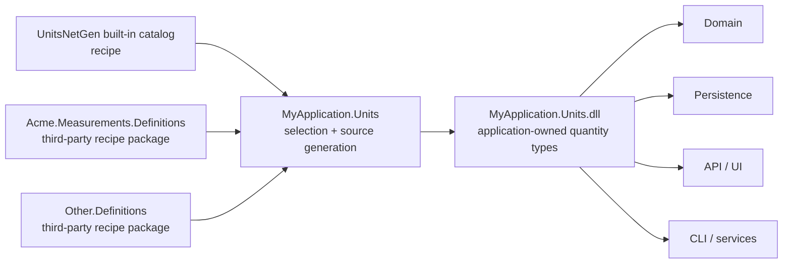

# UnitsNetGen

UnitsNetGen is a proof of concept for composing lean, strongly typed quantities and units at compile
time. It combines a small runtime with a Roslyn source generator and supports both built-in catalog
definitions and consumer-selected third-party definition packages.

Generated quantities and modern UnitsNet v6 assets implement the shared self-typed
`UnitsNet.Core.IQuantity<TSelf, TUnit, TValue>` contract. It exposes stored value, unit, and
conversion as instance behavior, with semantic identity, base unit, and construction on the
quantity type. Linear, affine, and logarithmic capability interfaces mirror their different
arithmetic semantics. This enables generic algorithms and source/data interoperation without
claiming that concrete structs generated into different assemblies have the same CLR type.

Each generated quantity owns a static `Convert(value, fromUnit, toUnit)` primitive and the familiar
instance `As(unit)` and `ToUnit(unit)` members. Conversion uses immutable generated metadata rather
than runtime registration or a global quantity lookup.

**Experimental:** UnitsNetGen's API and package format may change while the architecture is being
explored.

## Select built-in quantities

Reference the package, then declare a module interface:

```csharp
using UnitsNetGen.BuiltIns;
using UnitsNetGen.Generation;

[UnitsNetModule]
internal interface EngineeringUnits :
    IInclude<Length>,
    IInclude<Temperature>,
    IInclude<Information>;
```

Select a subset of units with a regular expression:

```csharp
[UnitSet("regex:.*Meter$")]
internal interface MeterUnits;

[UnitsNetModule]
internal interface LeanUnits : IInclude<Length, MeterUnits>;
```

Select the available catalog with a profile and add individual quantities alongside it:

```csharp
using UnitsNetGen.Profiles;

[UnitsNetModule]
internal interface ApplicationUnits :
    IIncludeProfile<AllQuantities>,
    IInclude<MyCustomDefinition>;
```

Profiles provide defaults. A direct `IInclude<TQuantity, TUnitSet>` on the module overrides that
profile's unit selection for the same quantity. Profiles can be consumer-defined and nested.

The generated API includes strongly typed quantity structs and unit enums, parsing, formatting,
conversion, arithmetic, and localized abbreviations.

Shared Core algorithms operate on both UnitsNet and UnitsNetGen quantities:

```csharp
Length total = UnitsNet.Core.QuantityMath.Sum(new[]
{
    Length.FromKilometers(1),
    Length.FromMeters(500),
});
```

Generate the selected API in the established `UnitsNet` and `UnitsNet.Units` namespaces with
`[UnitsNetModule("UnitsNet")]`. The compatibility samples compile the exact same linked consumer
source against UnitsNet v6 and UnitsNetGen.

## Own the generated application module

Generate quantities once in an application-owned units library and reference that library from the
rest of the application. This gives domain, persistence, UI, and service projects the same CLR type
identity without giving up consumer control over the selection.

Third-party NuGets should normally be definition packages. They contribute public definition
markers, JSON definitions, localizations, and relationships, but no compiled quantity structs. The
application units project references those packages and selects their definitions alongside the
built-in catalog.

### Intended solution structure

The application has one project that owns generation. Every other application project references
that project instead of running UnitsNetGen independently:

```text
MyApplication.slnx
└── src
    ├── MyApplication.Units
    │   ├── MyApplication.Units.csproj
    │   └── ApplicationUnits.cs
    ├── MyApplication.Domain
    │   └── MyApplication.Domain.csproj      -> MyApplication.Units
    ├── MyApplication.Persistence
    │   └── MyApplication.Persistence.csproj -> MyApplication.Units
    ├── MyApplication.Api
    │   └── MyApplication.Api.csproj         -> MyApplication.Units
    └── MyApplication.Cli
        └── MyApplication.Cli.csproj         -> MyApplication.Units
```

`MyApplication.Units` references `UnitsNetGen` and any third-party definition packages. Its module
marker selects the built-in and third-party definitions the application needs. The generated
quantity structs, unit enums, conversions, formatting, parsing, and cross-quantity operators all
become part of `MyApplication.Units.dll`.



The packages on the left are recipes: they describe quantities, units, localizations, conversions,
and relationships. The application project in the middle decides which recipes to combine and owns
the resulting CLR types. This single generation boundary is what lets every project on the right
exchange the same strongly typed values.

### Package models

There are two possible models for distributing third-party quantities:

1. A **compiled quantity package** generates and ships its own quantity structs and unit enums.
   This is convenient for a fixed, standalone API, but the package author chooses the available
   quantities and units. Two packages that independently compile the same logical quantity create
   different CLR types. A consumer also cannot freely compose operators across those package
   boundaries, because neither independently compiled assembly owns both operand types.
2. A **definition package** ships public marker interfaces together with JSON definitions,
   localizations, conversion expressions, and relationships. It does not ship compiled quantity
   structs. The consuming application selects the definitions and generates them once in its own
   units project.

UnitsNetGen chooses the definition-package model for third-party extensibility. It preserves the
consumer's ability to bring only the quantities and units it needs, makes built-in and third-party
relationships visible to one generator, and gives all generated types one predictable assembly
identity inside the application. It also avoids forcing a third party's selection and generation
policy on every consumer.

A compiled module can still be useful when an organization deliberately wants to publish one
canonical quantity assembly for several applications. That is a deployment choice rather than the
primary composition model, and independently compiled modules do not gain type identity or operator
interoperability merely because their definitions have the same names.

The `Samples/ConsumerOwned` scenario shows both repository integration modes side by side:

- `ConsumerOwned.Units` is the canonical package-facing project. It consumes locally packed
  `UnitsNetGen` and `Fictional.Measurements.Definitions` packages and receives the recipe files
  through the definition package's `build/*.props`.
- `ConsumerOwned.Units.ProjectReferences` compiles the exact same linked module declaration using
  direct project references. It includes the definition files explicitly because NuGet build
  content does not flow through a `ProjectReference`.

Feature-focused samples use project references for a fast repository development loop. The two
NuGet-facing scenarios validate package integration: `UnitsNetGen.NuGet.Sample` covers a minimal
consumer-owned JSON file, while `ConsumerOwned.Units` composes a separate definition package into
an application-owned shared assembly.

See `Samples/DefinitionPackages/Fictional.Measurements.Definitions` and
`Samples/ConsumerOwned` for the complete packable-provider and shared-consumer scenario.

## Add custom quantities

Add a UnitsNet-style JSON definition to the project:

```xml
<ItemGroup>
  <UnitsNetGenDefinition Include="HowMuch.unitsnet.json" />
</ItemGroup>
```

Bind a marker to the definition's logical namespace and name, then select it like a built-in
quantity:

```csharp
namespace Fictional;

using UnitsNetGen.Generation;

[QuantityDefinition("Fictional.Measurements.HowMuch")]
public interface HowMuchDefinition;

[UnitsNetModule]
internal interface FictionalUnits : IInclude<HowMuchDefinition>;
```

Custom definitions support localized abbreviations, prefix expansion, and affine or nonlinear
conversion expressions.

Custom definitions can also contribute relationships. Third-party packages should use structured
semantic quantity IDs so relationships remain unambiguous across generated namespaces:

```xml
<ItemGroup>
  <UnitsNetGenRelation Include="HowMuch.unitsnet.relations.json" />
</ItemGroup>
```

```json
[
  {
    "result": {
      "quantity": "Fictional.Measurements.HowMuchDistance",
      "unit": "SomeMeter"
    },
    "left": {
      "quantity": "Fictional.Measurements.HowMuch",
      "unit": "Some"
    },
    "operator": "*",
    "right": {
      "quantity": "UnitsNet.Length",
      "unit": "Meter"
    }
  }
]
```

Multiplication is expanded in both operand orders, and division relationships are inferred unless
disabled by the relation. Operators are emitted when their participating quantities are selected,
even when they use different generated namespaces or omit the relation's anchor units from their
public unit enums. Existing UnitsNet string equations remain supported for the built-in catalog.

## Learn more

See the
[proof-of-concept architecture](https://github.com/angularsen/UnitsNet/blob/master/UnitsNetGen/ARCHITECTURE.md)
and [sample projects](https://github.com/angularsen/UnitsNet/tree/master/UnitsNetGen/Samples) for the
full design and working scenarios.
